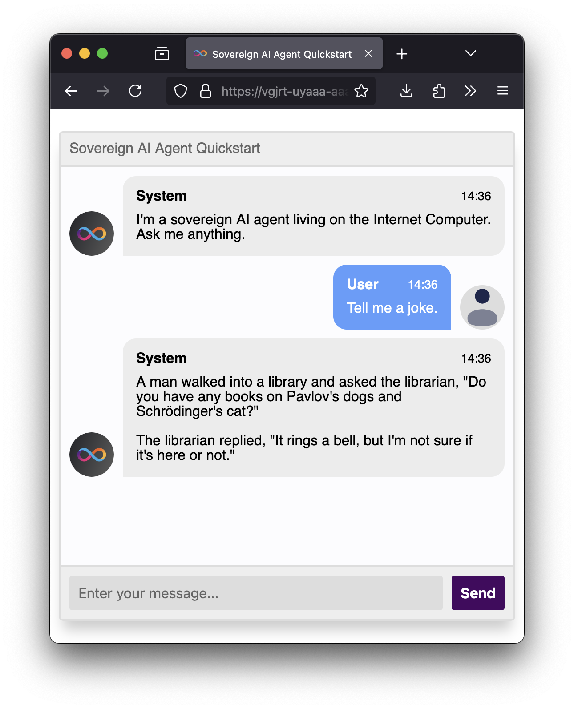

# LLMs on the IC

  

    
  

This repo contains libraries and examples of how to use the [LLM canister](https://a4gq6-oaaaa-aaaab-qaa4q-cai.raw.icp0.io/?id=w36hm-eqaaa-aaaal-qr76a-cai) on the IC.

## Libraries

The following libraries can be used to build AI agents on the Internet Computer with a few lines of code.

### Rust Library (`ic-llm`)

[Documentation](https://docs.rs/ic-llm/latest/ic_llm/)

### Motoko Library (`mo:llm`)

[Documentation](https://mops.one/llm)

### TypeScript Library (`@dfinity/llm`)

[Documentation](https://www.npmjs.com/package/@dfinity/llm)

## Example Agents

### Quickstart Agent

This is a simple agent that simply relays whatever messages the user gives to the underlying models without any modification.
It's meant to serve as a boilerplate project for those who want to get started building agents on the IC.

A Rust and a Motoko implementation are provided in the `examples` folder.

Additionally, a live deployment of this agent can be accessed [here](https://vgjrt-uyaaa-aaaal-qsiaq-cai.icp0.io/).

### ICP Lookup Agent

Showcases what it's like to build an agent that specializes in a specific task. In this case, the task is to lookup ICP prices.

A Rust and a Motoko implementation are provided in the `examples` folder.

Additionally, a live deployment of this agent can be accessed [here](https://twf3b-uqaaa-aaaal-qsiva-cai.icp0.io/).

