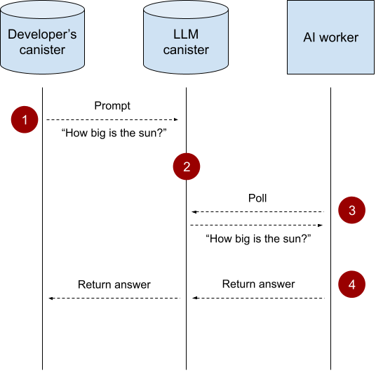

# LLMs on the IC

This repo contains libraries and examples of how to use the [LLM canister](https://a4gq6-oaaaa-aaaab-qaa4q-cai.raw.icp0.io/?id=w36hm-eqaaa-aaaal-qr76a-cai) on the IC.

## Libraries

The following libraries can be used to build AI agents on the Internet Computer with a few lines of code.

### Rust Library (`ic-llm`)

- [Explanation & Examples](rust/README.md) - Setup, usage examples, and tool documentation
- [API Documentation](https://docs.rs/ic-llm/latest/ic_llm/) - Complete API reference

### Motoko Library (`mo:llm`)

- [Explanation & Examples](motoko/README.md) - Setup, usage examples, and tool documentation
- [Package Documentation](https://mops.one/llm) - Package registry and info

### TypeScript Library (`@dfinity/llm`)

- [Explanation & Examples](typescript/README.md) - Setup, usage examples, and tool documentation
- [NPM Package](https://www.npmjs.com/package/@dfinity/llm) - Package installation and info

## Example Agents

### Quickstart Agent

This is a simple agent that simply relays whatever messages the user gives to the underlying models without any modification.
It's meant to serve as a boilerplate project for those who want to get started building agents on the IC.

Rust, Motoko, and TypeScript implementations are provided in the `examples` folder.
- [Rust Quickstart Agent](examples/quickstart-agent-rust/README.md)
- [Motoko Quickstart Agent](examples/quickstart-agent-motoko/README.md)
- [TypeScript Quickstart Agent](examples/quickstart-agent-typescript/README.md)

Additionally, a live deployment of this agent can be accessed [here](https://vgjrt-uyaaa-aaaal-qsiaq-cai.icp0.io/).

### ICP Lookup Agent

Showcases what it's like to build an agent that specializes in a specific task. In this case, the task is to lookup ICP prices.

A Rust and a Motoko implementation are provided in the `examples` folder.
- [Rust ICP Lookup Agent](examples/icp-lookup-agent-rust/README.md)
- [Motoko ICP Lookup Agent](examples/icp-lookup-agent-motoko/README.md)

Additionally, a live deployment of this agent can be accessed [here](https://twf3b-uqaaa-aaaal-qsiva-cai.icp0.io/).

## Understanding Chat Message Roles

When building chat applications, you'll work with different message types that serve specific purposes:

- **User**: Messages from the end user asking questions or making requests
- **System**: Instructions that define the AI's behavior and personality (e.g., "You are a helpful assistant")
- **Assistant**: Responses generated by the LLM
- **Tool**: Results from function calls that the LLM can make to external services

Example conversation flow:
1. **System**: "You are a helpful financial advisor"
2. **User**: "What's the current ICP price?"
3. **Assistant**: Makes a tool call to fetch ICP price
4. **Tool**: Returns the current price data
5. **Assistant**: "The current ICP price is $10.50"

## How Does it Work?
The processing of LLM prompts is done by what we call “AI workers”. These are stateless nodes set up for the sole purpose of processing LLM prompts.

Here’s a clarifying diagram:

1. Canisters send prompts to the LLM canister.
2. The LLM canister stores these prompts in a queue.
3. AI workers continuously poll the LLM canister for prompts.
4. AI workers execute the prompts and return the response to the LLM canister, which returns it to the calling canister.

# FAQ
**Q**: What models are supported?
**A**: For now, only the Llama 3.1 8B is supported. More models, based on your feedback, will be made available.

**Q**: What is the cost of using the LLM canister?
**A**: It’s free for now. As the system and use-cases mature we can evaluate and set the costs accordingly.

**Q**: Are there any limitations on the prompts I can make?
**A**: Yes. We’ve added a few limitations on how big the prompts and answers can be, and will gradually improve these over time:
 - A chat request can have a maximum of 10 messages.
 - The prompt length, across all the messages, must not exceed 10KiB.
 - The output is limited to 1000 tokens.

**Q**: Are my prompts private?
**A**: Yes and no. The Internet Computer as a whole doesn’t yet guarantee confidentiality, and the same is true for the AI workers. Someone who has an AI worker running can in theory see the prompts, but cannot identify who made the prompt. For DFINITY specifically, we do not log these prompts, but do log aggregated metrics like the number of requests, number of input/output tokens, etc.

**Q**: What is the principal of the LLM canister?
**A**: w36hm-eqaaa-aaaal-qr76a-cai

**Q**: Where is the source-code of the LLM canister?
**A**: It is not yet open-source, as the current implementation is mostly a throw-away prototype, but it will be open-sourced eventually as this work matures.
