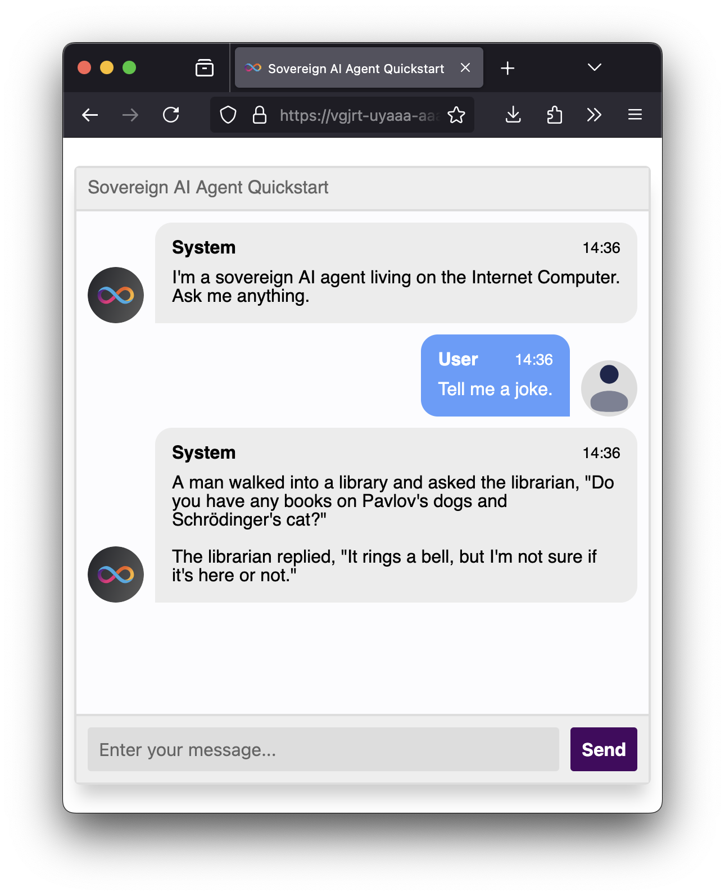

# AI Agent (Motoko)

This is a simple agent that simply relays whatever messages the user gives to the underlying models without any modification.
It's meant to serve as a boilerplate project for those who want to get started building agents on the IC.



## Quickstart
Prerequisites
- [DFX](https://internetcomputer.org/docs/current/developer-docs/smart-contracts/getting-started/hello10mins) installed
- [Ollama](https://ollama.com/) installed
- [PNPM](https://pnpm.io/) installed

```bash
# start ollama server
ollama serve

# Download the required model (one-time setup):
ollama run llama3.1:8b

# Start the local Internet Computer:
dfx start --clean

# Deploy the canisters:
dfx deploy
dfx deps deploy
```

Finally, access the agent at:
```
http://{FRONTEND_CANISTER_ID}.localhost:8080
```

## Deployment

### LLM Backend Configuration
The LLM canister supports two backend options for processing prompts:

1. **Ollama (Local)**: A free, self-hosted solution that runs on your local machine. Perfect for testing and development without any costs.

2. **Groq API**: A cloud-based solution that can handle larger models that might be too resource-intensive for local machines. Requires an API key (free for testing).

You can select your preferred backend by initialising the llm dependency through `dfx deps init` (see below for init arguments).

> **Note**: The llm canister currently only supports LLama3.1 8B independently of the backend that you choose. Further model support will be added in the near future.

#### Configure with Ollama
To be able to test the agent locally, you'll need a server for processing the agent's prompts. For that, we'll use `ollama`, which is a tool that can download and serve LLMs.
See the documentation on the [Ollama website](https://ollama.com/) to install it. Once it's installed, run:

```
ollama serve
# Expected to start listening on port 11434
```

The above command will start the Ollama server, so that it can process requests by the agent. Additionally, and in a separate window, run the following command to download the LLM that will be used by the agent:

```
ollama run llama3.1:8b
```

The above command will download an 8B parameter model, which is around 4GiB. Once the command executes and the model is loaded, you can terminate it. You won't need to do this step again.

Initialise the llm canister with `dfx deps init llm --argument '(opt variant { ollama }, null)'`. You can also inspect `deps/init.json` to see which backend will be used when launching the canister.
This backend is also the default backend and thus will work without calling the initialisation if the `deps/init.json` has not been changed.


#### Configure with Groq
As an alternative you can use the [Groq API](https://console.groq.com/home). You will need to create an [API key](https://console.groq.com/keys) first (free for testing purposes).

Initialise the llm canister with `dfx deps init llm --argument '(opt variant { groq = record { api_key = "{YOUR_API_KEY}" } }, null)'`, replacing `YOUR_API_KEY` with your own. You can also inspect `deps/init.json` to see which backend will be used when launching the canister.

### Deployment

Once your backend is set and initialized, you can start dfx and deploy the canisters.

First, install `pnpm` and run `pnpm install` in the `src/frontend` directory.

Then, in one terminal window, run:

```bash
dfx start --clean
```

Then pull the dependency and deploy the canisters in another window:

```bash
dfx deps pull
dfx deploy
dfx deps deploy  # deploys the llm canister
```

Once the deployment completes, you'll see the URL for the `agent-frontend` that looks like this:

```
http://0.0.0.0:8080/?canisterId={FRONTEND_CANISTER_ID}
```

Due to CORS policies on the browser, you should instead access the agent using the following URL:

```
http://{FRONTEND_CANISTER_ID}.localhost:8080
```
