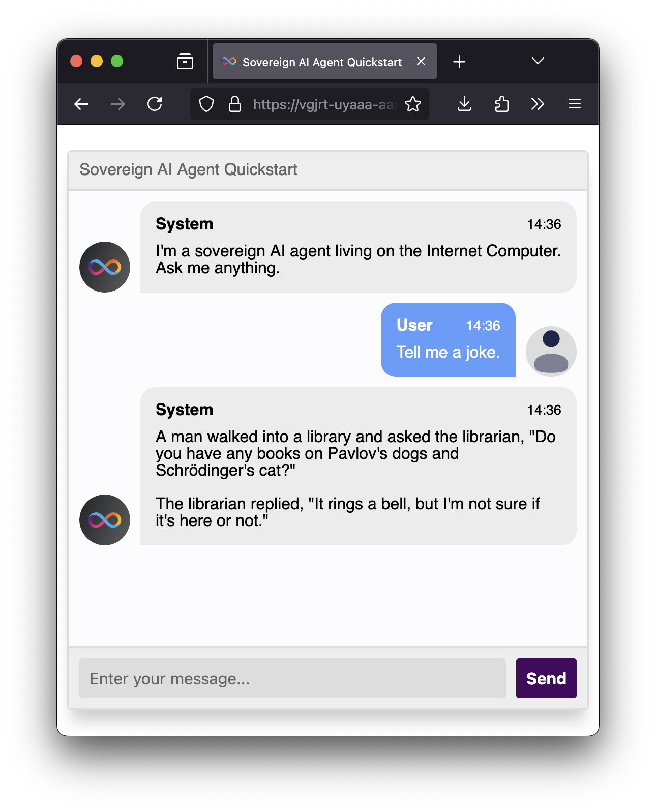

# Quickstart AI Agent (Rust)

A minimal agent that relays whatever messages the user gives to the underlying
model without modification. Use it as a starting point for your own agents on
the IC.



## Prerequisites

- [mise](https://mise.jdx.dev/) to install Rust, Node, and pnpm at the
  versions pinned in the repo's `mise.toml` (or install them yourself).
- Run `pnpm install` at the repo root once — that brings in
  [`icp-cli`](https://github.com/dfinity/icp-cli) and `ic-wasm` as project
  devDependencies, exposed on PATH via mise's `_.path` config.
- One of the two LLM backends below: by default the local `llm` canister
  uses [Ollama](https://ollama.com/) (free, runs on your machine). If you'd
  rather use [OpenRouter](https://openrouter.ai/) (a paid cloud service that
  can host larger models), see [LLM backend selection](#llm-backend-selection)
  for how to switch.

## Quickstart with Ollama

```bash
# Start Ollama (one window).
ollama serve

# Pull the model (one-time).
ollama run llama3.1:8b

# Start the local replica and deploy everything (separate window).
icp network start -d
icp deploy
```

The frontend URL is printed at the end of `icp deploy`. Open it in a browser
(use the `*.localhost:8080` form to avoid CORS issues).

## LLM backend selection

The on-chain `llm` canister has two backends:

1. **Ollama** (local, free) — the default. Suitable for development.
2. **OpenRouter** (cloud, paid) — needed for larger models. Requires an
   [API key](https://openrouter.ai/settings/keys).

The choice is encoded in `icp.yaml`'s `init_args` for the `llm` canister. To
switch from the default Ollama setup to OpenRouter, edit `icp.yaml`:

```yaml
canisters:
  - name: llm
    build:
      steps:
        - type: pre-built
          url: https://github.com/dfinity/llm/releases/download/v0.3.1/llm-canister.wasm
          sha256: 9fc6a172b13289428c6975895382c3c923fb641bcd8e8a5168469298c3cff310
    init_args: '(opt variant { openrouter = record { api_key = "YOUR_API_KEY" } }, null)'
```

Then reinstall the `llm` canister so the new init args take effect:

```bash
icp deploy llm --mode reinstall
```

## How it works locally

`icp-cli` injects `PUBLIC_CANISTER_ID:llm` into `agent-backend` at deploy
time, so the `ic-llm` SDK picks up the local replica's `llm` canister
principal automatically. On mainnet that env var isn't set and the SDK falls
back to the well-known principal `w36hm-eqaaa-aaaal-qr76a-cai`. No code
changes needed between environments.

## Deploying to mainnet

The committed `.icp/data/mappings/ic.ids.json` pins the existing mainnet
canister IDs (`vbixh-…` for `agent-backend`, `vgjrt-…` for `agent-frontend`).
Use the `ic` environment:

```bash
icp deploy -e ic
```

The `llm` canister is excluded from the `ic` environment in `icp.yaml` —
mainnet already runs the canonical LLM canister at `w36hm-…` and the SDK
addresses it directly.

## Frontend dev server

```bash
cd src/frontend && pnpm install
pnpm start
```

The dev server in `vite.config.js` mimics the asset canister by reading
`icp network status` + `icp canister status agent-backend` and setting an
`ic_env` cookie with the resolved IDs. The backend must be deployed
(`icp deploy agent-backend`) before `pnpm start` is run.
