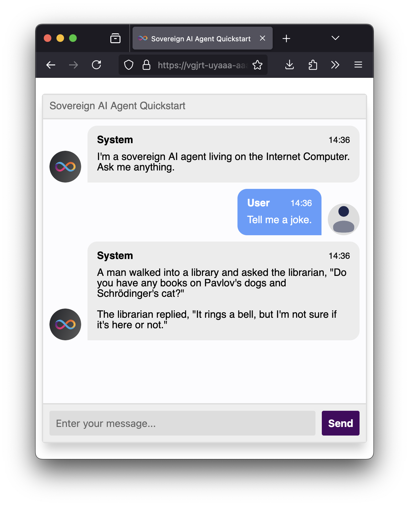

# Quickstart AI Agent (Rust)

A minimal agent that relays whatever messages the user gives to the underlying
model without modification. Use it as a starting point for your own agents on
the IC.



## Prerequisites

- [mise](https://mise.jdx.dev/) to install Rust, Node, and pnpm at the
  versions pinned in the repo's `mise.toml` (or install them yourself).
- Run `pnpm install` at the repo root once — that brings in
  [`icp-cli`](https://github.com/dfinity/icp-cli) and `ic-wasm` as project
  devDependencies, exposed on PATH via mise's `_.path` config.
- An API key for the Internet Intelligence Gateway — see
  [Getting an API key](#getting-an-api-key). The local `llm` canister uses it
  to serve prompts.

## Quickstart

Add your API key to the `llm` canister's `init_args` in `icp.yaml`
(see [Getting an API key](#getting-an-api-key)):

```yaml
init_args: '(opt variant { https = record { api_key = "YOUR_API_KEY" } })'
```

Then start the local replica and deploy everything:

```bash
icp network start -d
icp deploy
```

The frontend URL is printed at the end of `icp deploy`. Open it in a browser
(use the `*.localhost:8080` form to avoid CORS issues).

## Getting an API key

The local `llm` canister runs in `https` mode: it serves prompts by making
HTTPS outcalls to the Internet Intelligence Gateway, authenticated with an API
key. To get a key:

1. Sign up at https://inference.internetcomputer.org/beta.

Put the key in the `llm` canister's `init_args` in `icp.yaml`:

```yaml
init_args: '(opt variant { https = record { api_key = "YOUR_API_KEY" } })'
```

If you change the key after the first deploy, reinstall the `llm` canister so
the new init args take effect:

```bash
icp deploy llm --mode reinstall
```

## How it works locally

`icp-cli` injects `PUBLIC_CANISTER_ID:llm` into `agent-backend` at deploy
time, so the `ic-llm` SDK picks up the local replica's `llm` canister
principal automatically. On mainnet that env var isn't set and the SDK falls
back to the well-known principal `w36hm-eqaaa-aaaal-qr76a-cai`. No code
changes needed between environments.

## Deploying to mainnet

The committed `.icp/data/mappings/ic.ids.json` pins the existing mainnet
canister IDs (`vbixh-…` for `agent-backend`, `vgjrt-…` for `agent-frontend`).
Use the `ic` environment:

```bash
icp deploy -e ic
```

The `llm` canister is excluded from the `ic` environment in `icp.yaml` —
mainnet already runs the canonical LLM canister at `w36hm-…` and the SDK
addresses it directly.

## Frontend dev server

```bash
cd src/frontend && pnpm install
pnpm start
```

The dev server in `vite.config.js` mimics the asset canister by reading
`icp network status` + `icp canister status agent-backend` and setting an
`ic_env` cookie with the resolved IDs. The backend must be deployed
(`icp deploy agent-backend`) before `pnpm start` is run.
